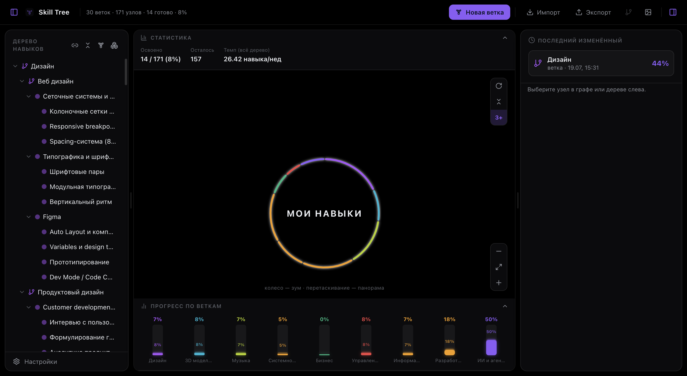

<div align="center">

# 🌳 Skill Tree

**Персональный трекер навыков в виде игрового радиального дерева скиллов** — в духе Watch Dogs: неоновый граф, «заряжающиеся» коннекторы и механика разблокировки «как в игре».

[](https://github.com/SWYOD/Skill-tree/releases/latest)
[](#-установка)
[](LICENSE)



</div>

## Что это

Skill Tree — не таск-трекер и не мудборд, а способ **увидеть свою учёбу целиком**: все темы, которые вы осваиваете, разложены по кольцам вокруг центрального хаба, а прогресс по каждой — реальный, посчитанный по чек-листам, а не «на глаз».

Никакого облака и аккаунта — всё дерево целиком лежит в выбранной вами папке в виде `.json` и `.md`-файлов, так что его можно версионировать в git, синхронизировать Syncthing'ом или положить прямо внутрь Obsidian-хранилища.

## Возможности

**Граф и структура**
- Радиальная раскладка: главные ветки — кольцом вокруг хаба, узлы и под-узлы — дальше по лучам, вложенность любой глубины.
- Ветки, узлы и группы — у каждого свой цвет, иконка (курируемый набор Lucide-иконок) и своя роль: ветка — тема, узел — конкретный навык со своим чек-листом и заметкой, группа — просто способ свернуть пачку элементов вместе.
- Зум, панорама, сворачивание/разворачивание прямо на графе, режим «первые 3 кольца» для больших деревьев.
- Поп-ап узла по долгому нажатию — полное название, чек-лист, и тут же кнопки «Создать узел» / «Удалить», без похода в правую панель.

**Прогресс и разблокировка**
- Чек-лист внутри каждого узла — прогресс в % считается автоматически и поднимается по дереву до самого хаба.
- Игровая механика разблокировки: узел заблокирован, пока не пройден его родитель (можно отключить), плюс ручная блокировка «не трогать эту тему пока».
- Статистика темпа обучения — сколько навыков реально закрыто за день/неделю/месяц, не оценка, а факт.

**Заметки**
- Markdown-заметка на каждый узел, хранится обычным `.md`-файлом рядом с деревом.
- Живой Obsidian-style Live Preview прямо во время набора, режим «сплит» (текст и рендер рядом), поддержка callout-блоков (`> [!tip]`, `> [!warning]` и т.д.).

**Темы и шрифты**
- 8 встроенных тем (AMOLED/Watch Dogs, Синтвейв, Nuxt UI, Linear, GitHub Dark, Dracula, Discord, Claude Desktop) + полноценный редактор своих тем и импорт/экспорт темы в JSON.
- Отдельный выбор шрифта интерфейса — по умолчанию, из темы или свой (курируемый список системных шрифтов + поле с автоподсказкой по мере набора).

**Экспорт и импорт**
- Импорт/экспорт всего дерева или отдельной ветки в JSON — ветка всегда безопасно добавляется поверх текущего дерева (перегенерация id, без риска случайно затереть всё остальное).
- Экспорт графа в PNG через отдельный диалог: своя тема и шрифт для экспорта (независимо от текущих настроек интерфейса), фон вкл/выкл (прозрачный PNG), паттерн узлов «как сейчас в графе» или «полностью развёрнутый», живое превью перед сохранением.

## 📦 Установка

Готовые сборки — на странице **[Releases](https://github.com/SWYOD/Skill-tree/releases/latest)**:

- **macOS** — `.dmg` (Intel и Apple Silicon)
- **Windows** — установщик `.exe` или portable-версия

Приложение само проверяет обновления и предлагает установить новую версию при запуске.

## Хранение данных

Ничего не уходит в облако — всё лежит в выбранной вами директории:

```
<корень>/
  store.json         # структура дерева, чеклисты, цвета, иконки
  notes/<id>.md       # заметки узлов (можно положить прямо в Obsidian-vault)
```

## 📖 Документация

Подробный гайд по всем возможностям — в [`docs/User-Guide.md`](docs/User-Guide.md).

## Разработка

```bash
npm install
npm run dev        # запуск в режиме разработки (Electron)
```

Прочие команды:

```bash
npm run build       # production-сборка в out/
npm run typecheck   # проверка типов
npm run dist:mac     # локальная сборка .dmg/.zip без публикации
npm run dist:win     # локальная сборка .exe без публикации
```

## Стек

Electron · React · TypeScript · Vite (electron-vite) · Zustand · d3-hierarchy · Framer Motion · CodeMirror · lucide-react.

## Лицензия

MIT
