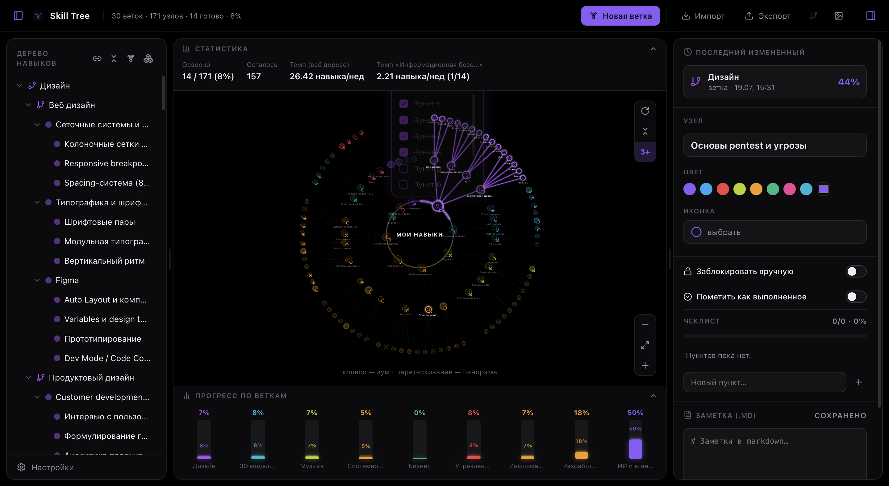
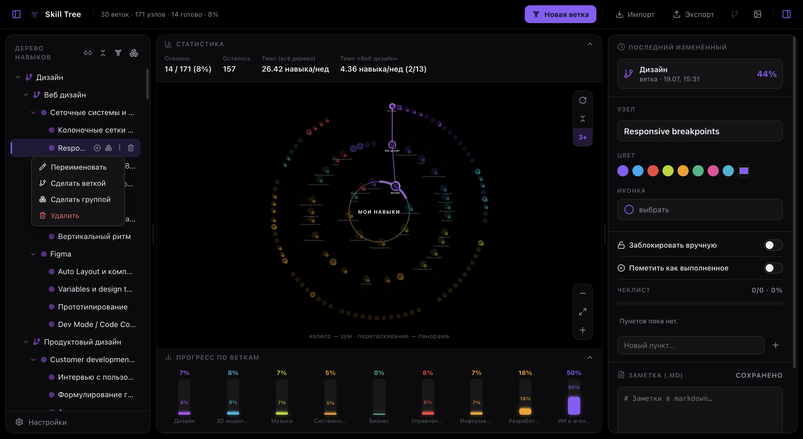
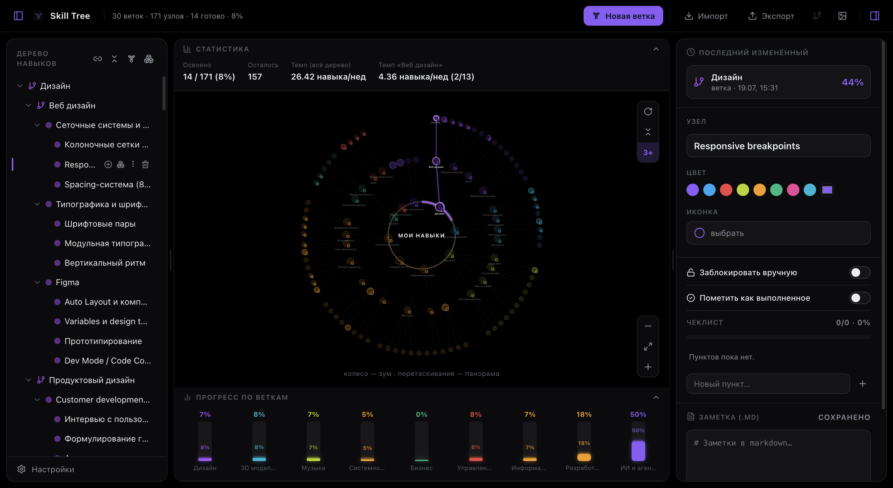
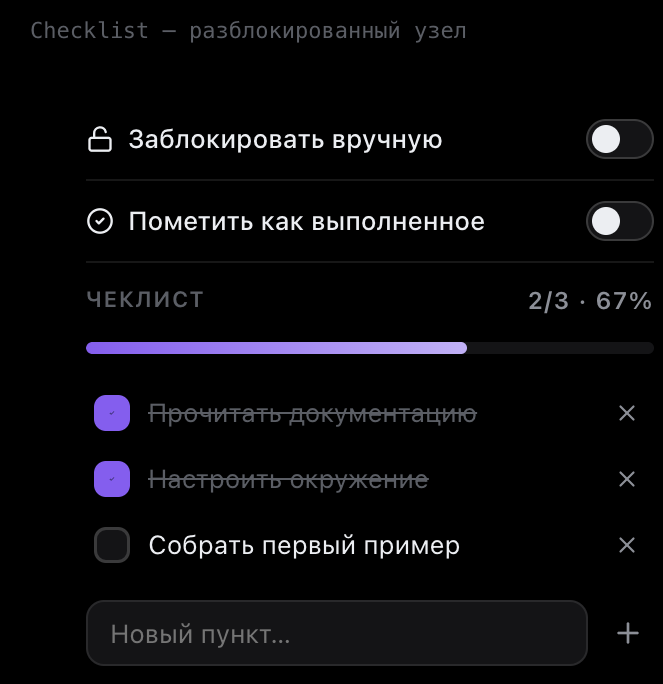
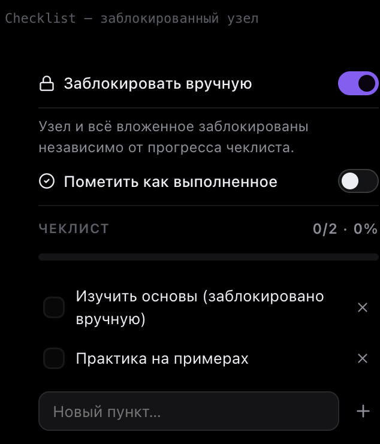
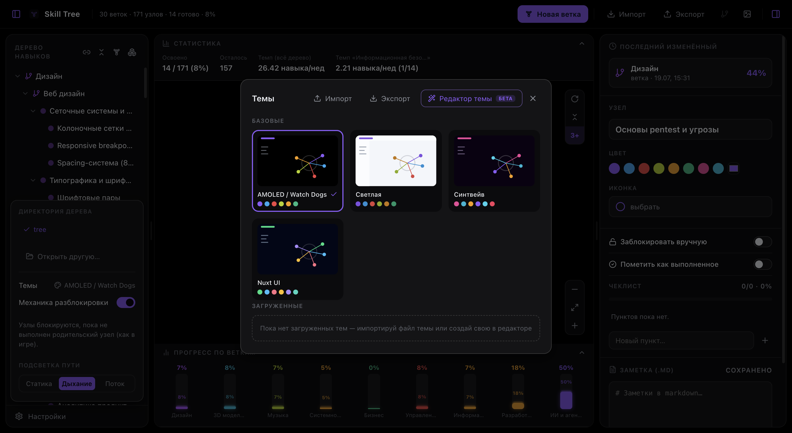
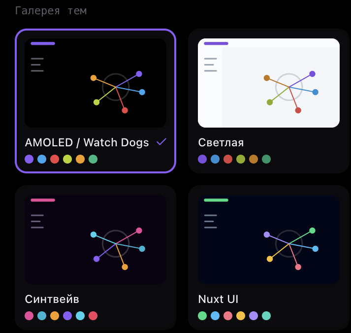
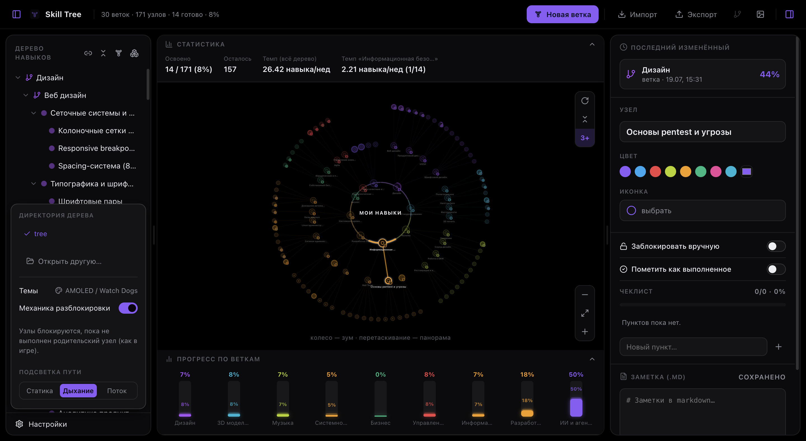

# Skill Tree — Юзер-гайд

> [!info] Что это
> **Skill Tree** — персональный трекер навыков в виде радиального дерева: ветки, узлы (конкретные навыки) и группы, с прогрессом по чек-листам, механикой разблока «как в игре» и заметками в markdown прямо у каждого узла.


---

## Содержание

- [[#Быстрый старт]]
- [[#Структура дерева — ветки, узлы, группы]]
- [[#Граф]]
- [[#Левая панель — дерево навыков]]
- [[#Правая панель — детали узла]]
- [[#Заметки]]
- [[#Статистика]]
- [[#Темы]]
- [[#Импорт и экспорт]]
- [[#Горячие клавиши и мелочи]]

---

## Быстрый старт

1. При первом запуске приложение попросит выбрать **директорию** — туда лягут `store.json` (само дерево) и папка `notes/` с markdown-заметками.
2. Нажмите **«Новая ветка»** в шапке, чтобы создать первую ветку — это корневая тема (например, «Дизайн» или «Программирование»).
3. Внутри ветки добавляйте **узлы** — конкретные навыки, которые нужно освоить.
4. Отмечайте прогресс через чек-лист узла — граф и статистика обновятся сами.

> [!tip] Одно дерево — одна директория
> Директорию можно сменить в любой момент (Настройки → директория), приложение хранит несколько последних в списке «недавних».

---

## Структура дерева — ветки, узлы, группы

Три типа элементов, у каждого свой смысл:

| Тип | Значок | Назначение |
|---|---|---|
| **Ветка** | вилка/branch-иконка | Корневая тема на кольце графа. Прогресс — среднее по всем узлам внутри. |
| **Узел** | кружок | Конкретный навык: свой чек-лист, заметка, цвет, иконка. Можно вкладывать узлы друг в друга сколь угодно глубоко. |
| **Группа** | иконка коробок | Чисто организационная обёртка без своего прогресса — просто удобно сворачивать пачку узлов вместе. |

> [!note] Узел-«папка»
> Узел без собственного чек-листа, но с вложенными под-узлами (например, «Figma» → «Auto Layout», «Прототипирование»…) — это тоже нормально. Такой узел работает как прозрачная папка: его статус считается по вложенным узлам, а не по пустому чек-листу.
>
> Если же у узла есть **и свой чек-лист, и дети** — статус берётся из его собственного чек-листа: это его личный прогресс, а не обёртка.

---

## Граф

Радиальный граф — главный экран приложения. Хаб в центре — корень дерева, ветки расходятся кольцом, узлы — дальше по лучам.

**Управление:**
- колесо мыши — зум;
- перетаскивание — панорама;
- клик по узлу — выбрать (подсветится путь от хаба и откроется правая панель);
- двойной клик — «раскрыть» путь к узлу в левом дереве и проскроллить к нему;
- зажать узел (~0.5 сек) — всплывающая карточка с полным названием и чек-листом (можно отмечать прямо там, не открывая правую панель).



> [!tip] Подсветка держится, пока открыт поп-ап
> Пока поп-ап узла открыт, подсветка его пути к хабу не гаснет — даже если панорамировать граф или навести курсор на другой узел (наведение на другой узел подсветит его временно, поверх).

### Кнопки над графом

- **↻** — перерисовать граф (переиграть анимацию появления);
- **⇕** — свернуть/развернуть всё;
- **3+** — показать только первые 3 кольца от каждой ветки (на больших деревьях так читаемее);
- **− / ⤢ / +** — зум и «по центру».

### Механика разблока

> [!warning] Узел может быть заблокирован
> Если в настройках включена **«Механика разблока»** (по умолчанию — да), узел заблокирован, пока не выполнен его родительский узел. Заблокированные узлы показаны серым с иконкой замка. Пункты чек-листа при этом видно и можно редактировать текст, но отмечать их выполненными нельзя, пока родитель не будет пройден.

Отдельно — **ручная блокировка** (переключатель «Заблокировать вручную» у самого узла): блокирует узел и всё вложенное независимо от прогресса, для «пока не трогать эту тему».

### Название дерева

Название графа (то, что написано в центре хаба, «МОИ НАВЫКИ» по умолчанию) можно переименовать — кликните на иконку карандаша рядом с названием дерева в шапке приложения, рядом с «Skill Tree».

---

## Левая панель — дерево навыков

Классическое дерево слева дублирует граф в текстовом виде — удобно для быстрой навигации и массовых операций.

**Быстрые действия у каждой строки** (появляются при наведении):
- ➕ добавить под-ветку / узел / группу;
- 👁 **скрыть с графа** — элемент (и всё вложенное) перестаёт рисоваться на графе, но остаётся в дереве и данных, просто выглядит приглушённым;
- ⋮ ещё — переименовать, сменить тип (ветка↔узел↔группа), сгруппировать выделенное, удалить;
- 🗑 удалить.



**Мультивыделение:** `Cmd/Ctrl + клик` — добавить к выделению, `Shift + клик` — выделить диапазон. Мультивыделенные элементы можно вместе удалить, сгруппировать или перетащить.

**Drag-and-drop:** перетаскивание строки на другую — перенос в её начало/конец списка или **внутрь** (если навести на середину строки-контейнера).

---

## Правая панель — детали узла

Открывается по клику на узел (в графе или дереве). Три блока: инспектор, чек-лист, заметка.



### Чек-лист и блокировка

Чек-лист доступен всегда для чтения/редактирования текста, но отмечать пункты выполненными можно только пока узел **не заблокирован**:

<table>
<tr><td>



</td><td>



</td></tr>
</table>

> [!info] «Пометить как выполненное»
> Для узлов без чек-листа (или если чек-лист не нужен) есть отдельный переключатель — считает навык освоенным на 100% без единого пункта. Он же доступен прямо в поп-апе узла на графе.

---

## Заметки

У каждого узла — своя markdown-заметка, хранится файлом рядом с деревом (`notes/<Название>-<id>.md` — человекочитаемое имя + технический суффикс для уникальности; при переименовании заметки файл переименовывается автоматически, id-суффикс не трогается).


**Заголовок заметки** — отдельное поле над редактором, по умолчанию совпадает с названием узла, но можно задать своё (клик → ввод → Enter/клик мимо).

**Два режима прямо в панели:**
- **Правка** — сырой markdown;
- **Просмотр** — отрендеренный текст (заголовки, списки, ссылки, код, callout-блоки).

**Полноэкранный редактор** (иконка ⤢) даёт ещё два варианта:
- **Динамический** — Obsidian-style Live Preview: форматирование применяется прямо во время ввода (заголовок сразу крупный и жирный, `**жирное**` сразу жирное), а сырые символы разметки показываются только когда курсор реально стоит на этой строке/внутри этого фрагмента;
- **Сплит** — сырой текст и рендер бок о бок.

**Поддерживаемый синтаксис:** заголовки `#`…`######`, **жирный**/*курсив*, `код`, ссылки `[текст](url)`, списки, код-блоки в ```оградах```, разделитель `---`, и Obsidian-callout'ы:

```markdown
> [!tip] Заголовок подсказки
> Текст самой подсказки — можно в несколько строк.
```

Поддерживаются типы: `note`/`info`, `tip`/`hint`, `success`/`check`/`done`, `warning`/`caution`, `danger`/`error`/`failure`, `question`/`faq`, `example`, `quote`/`cite` — у каждого свой цвет и иконка.

---

## Статистика

Панель над графом — сколько освоено, сколько осталось, и **темп** (сколько навыков реально завершено — по факту, за выбранный период: **День / Неделя / Месяц**).

> [!note] Темп — это факт, не прогноз
> Раньше темп считался как среднее с момента создания дерева, из-за чего на свежем дереве или после разовой массовой отметки «уже знаю» цифра сильно завышалась. Сейчас это честный счётчик: сколько узлов реально отмечено выполненными за выбранный период.

Ниже — «Прогресс по веткам»: цветной бар-чарт, сколько освоено в каждой ветке.

---

## Темы

Настройки → «Темы» открывает галерею.



Крупнее — как выглядят карточки (цвета в превью подтягиваются динамически из самого файла темы, не захардкожены):



Встроенные темы: **AMOLED / Watch Dogs** (по умолчанию, чистый чёрный + неон), **Светлая**, **Синтвейв**, **Nuxt UI**.

**Импорт/Экспорт** — тема экспортируется в `.json` и импортируется обратно тем же способом; можно поделиться своей темой или сохранить чужую. Формат — обычный JSON с полями `id`, `name`, `dark`, `vars` (CSS-переменные) и `branchColors`.

> [!info] Редактор темы
> Кнопка «Редактор темы» пока в разработке (помечена бета-плашкой) — создание своей темы через интерфейс, без ручной правки JSON, планируется позже.

---

## Импорт и экспорт

В шапке приложения:
- **Импорт** — целое дерево (`.json`) или отдельную ветку, добавит к текущему дереву;
- **Экспорт** — всё дерево или выбранную ветку в `.json`;
- **Экспорт графа в PNG** — снимок текущего вида графа.

---

## Горячие клавиши и мелочи

- `Delete` — удалить мультивыделение в левом дереве (с подтверждением);
- `Cmd/Ctrl + G` — сгруппировать мультивыделение;
- `Escape` — закрыть модалку/попап, отменить правку заголовка;
- клик мимо узла на графе — снять выделение.

> [!tip] Настройки
> Кнопка «Настройки» внизу левой панели — директория дерева, тема, механика разблока, стиль подсветки пути (статика/дыхание/поток).


